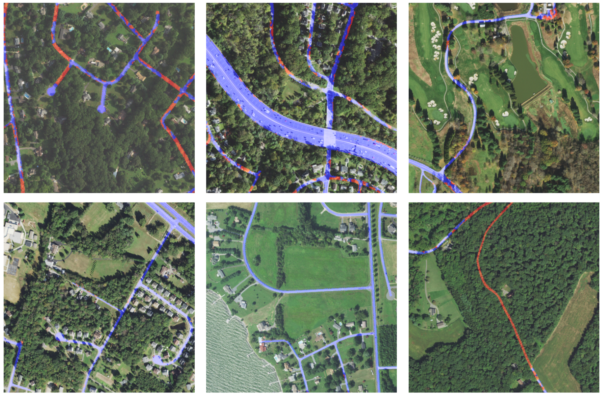

# Chesapeake Roads Spatial Context (RSC)

Code and experiments for the paper, ["Seeing the Roads Through the Trees: A Benchmark for Modeling Spatial Dependencies with Aerial Imagery"]() which introduces the **Chesapeake Roads Spatial Context (RSC) dataset**.

## Download

The dataset is available in HuggingFace Datasets and can be downloaded [here](https://huggingface.co/datasets/torchgeo/ChesapeakeRSC/)

## Dataset

     
    <b>Figure 1.</b> Example images and labels from the dataset. Labels are shown over the corresponding NAIP aerial imagery with the "Road" class colored in blue and the "Tree Canopy over Road" class in red.

We introduce a novel remote sensing dataset for evaluating a geospatial machine learning model's ability to learn long range dependencies and spatial context understanding. We create a task to use as a proxy for this by training models to extract roads which have been broken into disjoint pieces due to tree canopy occluding large portions of the road.

The dataset consists of 30,000 RGBN [NAIP](https://naip-usdaonline.hub.arcgis.com/) images and land cover annotations from the [Chesapeake Conservacy](https://www.chesapeakeconservancy.org/) containing significant amounts of the *"Tree Canopy Over Road"* category.

Models are trained to perform semantic segmentation to extract roads from the background but are additionally evaluated by how they perform on the *"Tree Canopy Over Road"* class. Furthermore, we weight each *"Tree Canopy Over Road"* pixel based on the L1 distance to the nearest *"Road"* pixel resulting in a distance-weighted recall (DWR) metric which we propose as a better proxy for long range modeling performance.

### Reproducing the dataset

We have included `download_data.py` that demonstrates how we created the aligned NAIP / land cover patches. This script uses the pre-sampled locations in `data/patches.gpkg` and the Maryland land cover dataset from [here](https://www.sciencebase.gov/catalog/item/633302d8d34e900e86c61f81) (it expects the `data/md_lc_2018_2022-Edition/md_lc_2018_2022-Edition.tif` to exist).